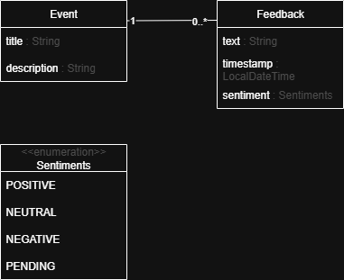

# IBM Internship Exercise: Event Feedback Analyzer

A fictional platform called EventSync. It helps teams organize events
like workshops, team buildings, or small conferences. After each event, participants
leave written feedback.
A backend application accepts this
feedback and automatically analyzes it using an AI sentiment analysis API (
Hugging Face). The system classifies each feedback as
positive, neutral, or negative and provides a summary per event.

## Setup

In order to use an AI agent for the project one must create an account on [https://huggingface.co](https://) and generate an access token there.

Inside folder *src\test\java\com\ibm\event_sync* there is a file named *application-secret.properties.example*. This file must be duplicated and renamed *application-secret.properties* (the additional file extention must be removed).

Paste the afforementioned access token into the newly created duplicate replacing the text *your_real_api_key_here*.

**DO NOT** add the file containing your access token to the git repository.

## Run

The project may be deployed either directly or using a docker container.

### Build

Run `./mvnw clean` for a clean rebuild.

### Run inside *Docker*

`docker build -t event-sync-app .`
`docker run -p 8081:8081 event-sync-app`

### Run directly

Run `./mvnw spring-boot:run` to run app.

## Test

Run `./mvn test` to run app tests.

## Debug

There is *.vscode/launch.json* file provided for debugging using the visual studio code IDE. It may be used in assisting of launching a debugging session.

## Project structure

### Code

Project backend code is located in *src\main\java\com\ibm\event_sync* folder.

In there:
* Web routes are defined inside *routing* folder.
* API routes are defined in *controller* folder.
* etc.

Views are located in *src\main\resources\templates* folder.

Tests are located in *src\test\java\com\ibm\event_sync* folder.

### Data

## Project specifications

* Java 17
* Maven
* Spring Boot
* H2 database

* *HuggingFace* *AI* model *nlptown/bert-base-multilingual-uncased-sentiment*